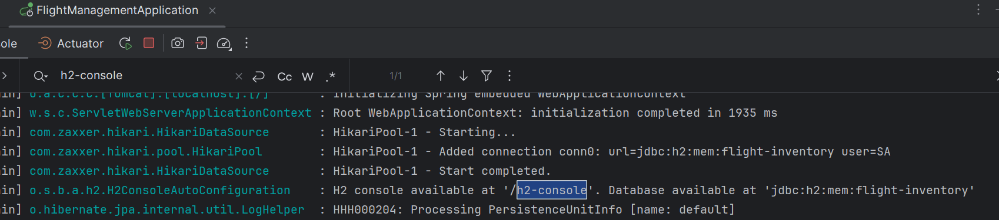
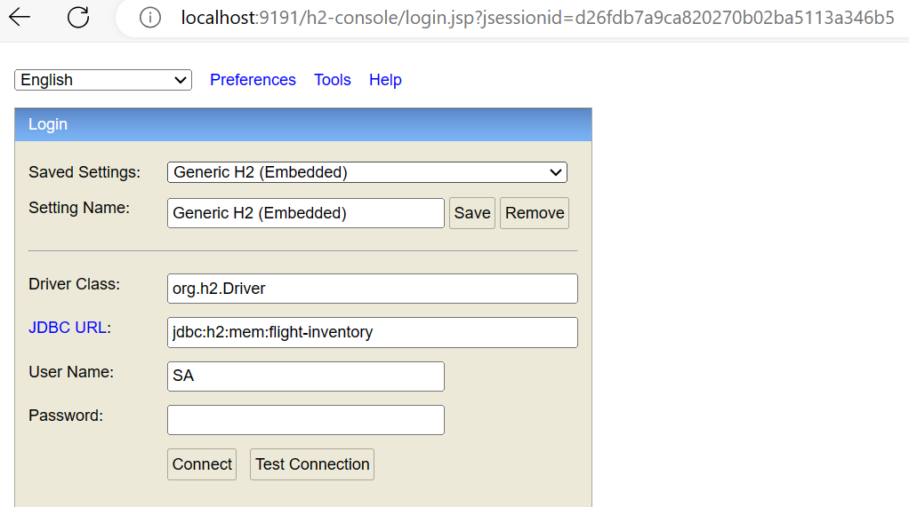

# Flight Management
This repository contains code and resources for a flight management system

##Clone the project

```bash
  git clone https://github.com/uttam-pasare/flight-management.git
```

## H2 setup
Let's understand how can we setup H2 database in spring based project 
Following dependency is needed to setup in-memory H2 database 

<dependency>
    <groupId>com.h2database</groupId>
    <artifactId>h2</artifactId>
    <scope>runtime</scope>
</dependency>

Spring data source properties to be configured inside application.properties
spring.datasource.url=jdbc:h2:mem:flight-inventory
spring.datasource.driverClassName=org.h2.Driver

default username is "SA" and password can be kept blank

Once you run the application, H2 database console can be found at http://localhost:9191/h2-console/ (server.port=9191)
JDBC url can be found at console logs


H2 console looks like below


## Tech Stack
**Database:** H2 in-memory database

**Language:** Java 17

**Frameworks:** Spring Boot, Spring JPA

## Support

For support, email uttam.r.pasare@gmail.com or join on LinkedIn (www.linkedin.com/in/uttam-pasare)